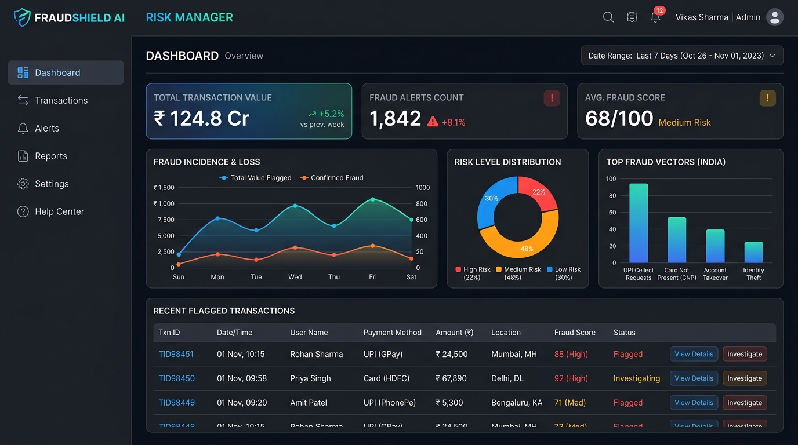
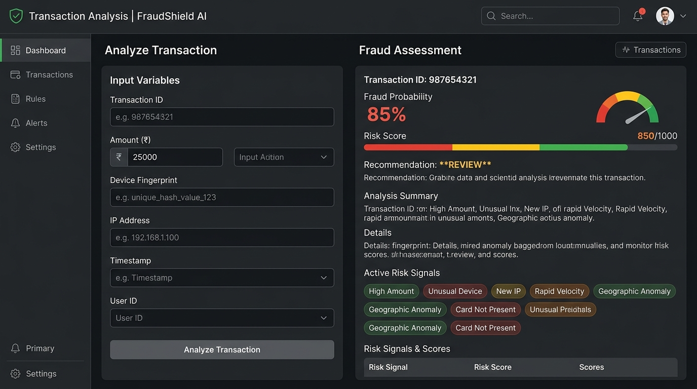
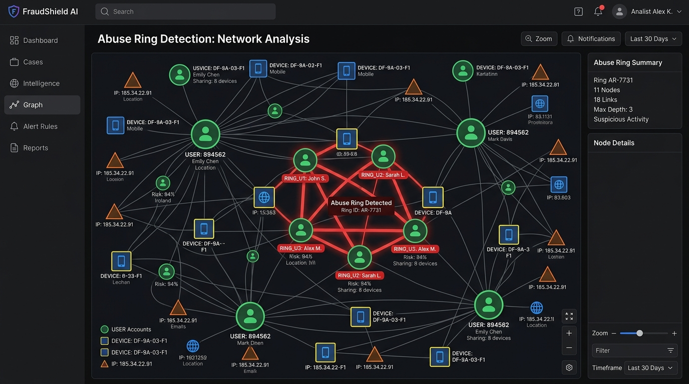
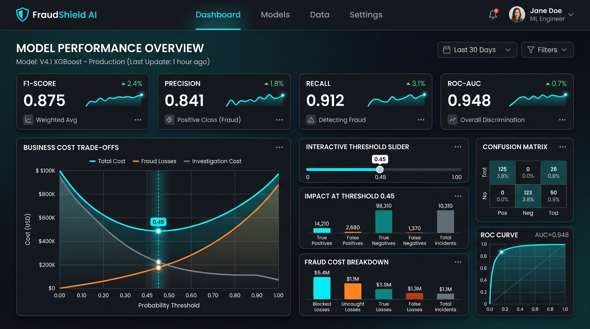

# FraudShield AI — Defensive Fraud Risk Detection

> A defensive real-time machine learning risk engine designed to prevent merchant losses to fraud, chargebacks, and coordinated abuse rings.

Live Demo: **[fraudshield-ai-pi.vercel.app](https://fraudshield-ai-pi.vercel.app/)**

---

## 📸 Screenshots

### 1. Dashboard Overview


### 2. Transaction Analysis (Real-time Evaluation)


### 3. Abuse Ring & Coordinated Syndicate Graphing


### 4. Model Performance & Financial Optimizer


---

## 📊 Machine Learning Performance Metrics

Evaluated on a held-out test set of **4,001** transaction records:

* **Precision**: `65.36%`
* **Recall**: `83.33%`
* **F1-Score**: `73.26%`
* **ROC-AUC**: `97.94%`
* **PR-AUC**: `83.44%`
* **F1-Max Threshold**: `0.89`
* **Optimal Financial Threshold**: `0.90` (saves **₹25,530.44** on the test set, reducing baseline business losses by 85.6%).

---

## 🔒 Security & Architecture

1. **Default-Deny Row Level Security (RLS)**: Public tables allow **zero** direct client-side CRUD access (all open `anon` and `authenticated` access policies have been removed).
2. **Edge Function Boundary**: All mutations, alerts, and transaction evaluations are routed through the secure Supabase Edge Function (`/transactions/analyze`).
3. **Secrets Isolation**: Client-side queries never expose the `SUPABASE_SERVICE_ROLE_KEY`. It is strictly read server-side by the Edge Function.
4. **Configurable CORS Allowed Origin**: Replaced wildcard (`*`) access with strict origin validation checking the `ALLOWED_ORIGIN` env variable.
5. **Server-Side Relationship counts**: Coordinated device fingerprint and IP address sharing accounts are calculated strictly server-side, preventing clients from spoofing trust parameters.

---

## ⚠️ Important Disclaimers

* **Synthetic Dataset**: The machine learning model is trained, validated, and evaluated entirely on a **synthetically generated dataset** simulating standard ecommerce profiles.
* **Estimated Savings**: Financial optimizer workbench calculations are simulated under project-defined parameters (e.g., chargeback friction, alert investigation costs) and do not represent actual Razorpay system figures.
* **Demo-Only Endpoints**: The `/demo/setup-abuse-ring` endpoint is designed strictly for Scenario C test reproducibility and is not an active production path.

---

## 🚀 Getting Started

### Local Setup
1. **Clone and install dependencies**:
   ```bash
   npm install
   ```

2. **Configure environment variables**:
   Create a `.env` file in the root based on `.env.example`:
   ```env
   VITE_SUPABASE_URL=https://your-project.supabase.co
   VITE_SUPABASE_ANON_KEY=your_supabase_anon_key
   ```

3. **Run tests**:
   All 30 unit and integration tests are verified and passing:
   ```bash
   npm test
   ```

4. **Production Build**:
   ```bash
   npm run build
   ```
