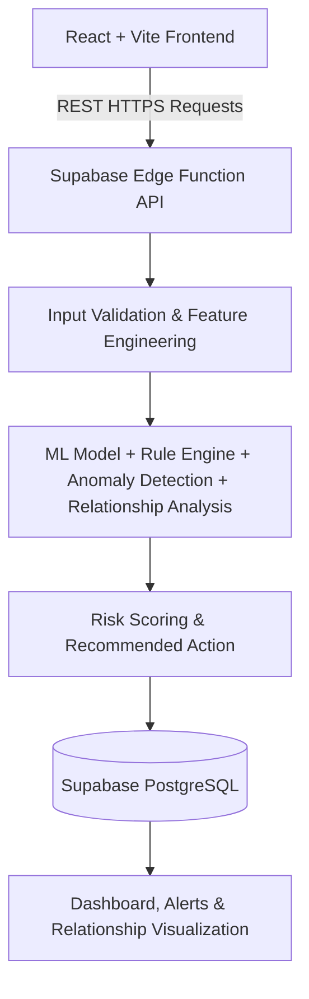

# FraudShield AI

> AI-Powered Payment Fraud & Risk Detection Platform

Live Demo: **[fraudshield-ai-pi.vercel.app](https://fraudshield-ai-pi.vercel.app/)**  
GitHub Repository: **[github.com/nagavijayvasu/fraudshield-ai](https://github.com/nagavijayvasu/fraudshield-ai)**

---

## 1. Project Overview
FraudShield AI is a defensive payment-risk platform that combines machine learning classifiers, real-time transaction feature engineering, rule-based anomaly detection, and graph-based account relationship analysis. 

The primary goal is to evaluate incoming transactions in real-time, detecting potential fraud, chargebacks, and syndicate abuse while using business cost optimization to minimize payment friction (false positives) for legitimate customers. This project is a buildathon prototype and not a production Razorpay integration.

---

## 2. Problem Statement
Online payment systems face a continuous trade-off:
* **Overly permissive systems** miss fraudulent transactions, leading to high chargeback fees and direct merchant losses.
* **Overly aggressive blocks** increase false positives, blocking legitimate users and causing transaction abandonment (loss of customer lifetime value).

FraudShield AI attempts to model and balance these two forces by aligning risk assessment levels with the actual financial cost of both fraud and customer friction.

---

## 3. Key Features
* **ML-Based Probability**: Estimates fraud likelihood using a Logistic Regression model.
* **0–100 Risk Scoring**: Combines ML probabilities with rule-based signals and network risk markers.
* **Explainable Risk Factors**: Returns specific root causes (e.g., high transaction density, location anomaly) alongside scores.
* **Behavioral & Anomaly Detection**: Tracks transaction velocity, new device/IP fingerprints, and historical chargebacks.
* **Abuse-Ring Sentinel**: Analyzes entity-relationship graphs linking User IDs, device IDs, and IP addresses to identify syndicate networks.
* **Financial Cost Optimizer**: Evaluates thresholds using cost-based sweeps to minimize net business losses.
* **Security Alerts**: Automatically files alerts for transactions flagged as medium or high risk.
* **Reproducible Scenarios**: Includes test cases representing different threat and user profiles.

---

## 4. Architecture



---

## 5. How FraudShield Works
The real-time transaction processing pipeline executes the following steps:
1. **Transaction Entry**: The frontend submits payment parameters to the edge API.
2. **Validation**: The backend validates parameters (IP format, positive amounts, transaction schema).
3. **Context Retrieval**: User statistics (historical averages) and device-IP node relationships are fetched from the database.
4. **Feature Engineering**: Features such as `amount_deviation` are computed dynamically on the server.
5. **ML Prediction**: A scikit-learn standardizer and Logistic Regression coefficients evaluate the transaction.
6. **Rule Engine & Network Check**: System rules analyze velocity anomalies and query the relationship graph for shared nodes.
7. **Risk Scoring**: Output probabilities, network links, and rule violations are compiled into a final score (0–100).
8. **Action Routing**: The system inserts transaction audit records, creates security alerts, and returns the risk level, score, and recommended action (`ALLOW`, `MONITOR`, `STEP_UP_VERIFICATION`, or `MANUAL_REVIEW`).

---

## 6. Model Performance
Model metrics were measured and verified on a held-out test set of **4,001** transactions:

| Metric | Value |
| :--- | :--- |
| **Precision** | `65.36%` |
| **Recall** | `83.33%` |
| **F1 Score** | `73.26%` |
| **ROC-AUC** | `0.9794` |
| **PR-AUC** | `0.8344` |
| **False Positive Rate (FPR)** | `1.37%` |
| **False Negative Rate (FNR)** | `16.67%` |

### Test Set Confusion Matrix
* **True Negatives (TN)**: `3,828`
* **False Positives (FP)**: `53`
* **False Negatives (FN)**: `20`
* **True Positives (TP)**: `100`

---

## 7. Financial Cost Optimizer
Standard machine learning models typically select a decision threshold that maximizes F1 score. However, this is not always financially optimal for merchants. FraudShield AI models the financial trade-offs:
* **False Positive Cost**: Operational investigation cost + customer friction margin loss.
* **False Negative Cost**: Cost of transaction amount + network chargeback fee.

By executing a threshold sweep on these cost functions, the optimal threshold was identified:

* **F1-Max Threshold**: `0.89`
* **Optimal Financial Threshold**: `0.90`
* **Baseline Estimated Loss (Unprotected)**: `₹23,86,108.80`
* **Optimized Estimated Loss (threshold 0.90)**: `₹3,43,673.60`
* **Net Loss Reduction**: **`₹20,42,435.20`** (an **`85.6%`** reduction in estimated losses)

> [!IMPORTANT]  
> **Disclaimer**: All financial values, savings, and costs are estimates based on project-defined assumptions and the evaluation dataset. They do not represent Razorpay production statistics, actual fee structures, or real-world savings.

---

## 8. Abuse-Ring Sentinel
FraudShield AI identifies coordinated syndicate activity by constructing a relationship graph between entity nodes:
* `User IDs`
* `Device Fingerprints`
* `IP Addresses`

At runtime, the edge API queries relationships to determine user sharing indices. Security signals include:
* `DEVICE_SHARING`: Triggered if a device fingerprint is associated with $\ge 3$ distinct User IDs.
* `IP_SHARING`: Triggered if an IP address is associated with $\ge 3$ distinct User IDs.
* `POTENTIAL_ABUSE_RING`: Triggered if both device and IP sharing bounds are breached.

To prevent manipulation, these relationship counts are calculated strictly **server-side** by querying the database, rather than trusting client-provided counts.

---

## 9. Demo Scenarios
The dashboard includes three interactive scenario presets to demonstrate platform capabilities:
* **Scenario A — Legitimate Transaction**: Low value, known device/IP, standard velocity.
  * *Expected Output*: `LOW RISK` / `ALLOW`
* **Scenario B — Suspicious Transaction**: High value, new device/IP, high velocity, previous chargebacks.
  * *Expected Output*: Elevated risk / `STEP-UP VERIFICATION` or `MANUAL REVIEW` depending on score.
* **Scenario C — Coordinated Abuse**: Uses shared fingerprints and IPs.
  * *Expected Output*: `POTENTIAL_ABUSE_RING` detected. The overall risk level is determined independently by the combined risk score. The abuse-ring signal triggers an escalated defensive action.
  * *Implementation Note*: The project includes a dedicated seeding endpoint `POST /demo/setup-abuse-ring` that seeds relationship records in the database before transaction analysis occurs. This allows the graph engine to evaluate relationship counts naturally.

---

## 10. Technology Stack

| Component | Technology | Description |
| :--- | :--- | :--- |
| **Frontend** | React, TypeScript, Vite, Tailwind CSS, Recharts | Interactive dashboards, workbench sliders, and graph nodes. |
| **Backend** | Supabase Edge Functions, Deno, TypeScript | Secure server-side validation and feature engineering. |
| **Database** | Supabase PostgreSQL | Storing transaction logs, profiles, alerts, and relations. |
| **Machine Learning** | Python, scikit-learn, Logistic Regression | Model training, threshold optimizer sweeps, StandardScaler coefficients. |
| **Deployment** | Vercel, Supabase | High-availability serverless API hosting. |

---

## 11. Security Measures
* **Backend Input Validation**: Sanitizes and validates transaction requests prior to risk routing.
* **API Rate Limiting**: Simple client IP rate-limiting to protect endpoints from abuse.
* **Configurable CORS**: Validates incoming request origins against an allowed deployment domain.
* **Default-Deny Supabase RLS**: Disabled public table queries, restricting all database writes and reads strictly to Edge Function executions.
* **Secrets Isolation**: Avoids exposing client-side credentials by storing `SUPABASE_SERVICE_ROLE_KEY` inside Deno environment variables.
* **Server-Side Counts**: Derives relationship counts directly from database structures.

---

## 12. Testing
Verified via **30 automated tests** targeting key logic components:
* **Input Validation**: Null values, zero bounds, format verification.
* **Feature Engineering**: amount_deviation calculation and training-serving skew alignment.
* **ML Predictions & Thresholds**: Score standardizations, probability outputs, financial sweeps.
* **Security Rules & Graph Nodes**: Single sharing markers, multi-account ring triggers.

To run the test suite:
```bash
npm test
```
* **Test Status**: `30 passed`, `0 failed`, `0 skipped`.

---

## 13. Running Locally
1. **Clone the repository and install dependencies**:
   ```bash
   git clone https://github.com/nagavijayvasu/fraudshield-ai.git
   cd fraudshield-ai
   npm install
   ```

2. **Set up local environment variables**:
   Create a `.env` file based on `.env.example`:
   ```env
   VITE_SUPABASE_URL=https://your-project.supabase.co
   VITE_SUPABASE_ANON_KEY=your_supabase_anon_key
   ```

3. **Verify and build**:
   ```bash
   npm test
   npm run dev
   npm run build
   ```

---

## 14. Dataset
* **Description**: Model training and evaluation utilize a synthetic ecommerce transaction dataset designed to simulate purchase sizes, locations, and device profiles.
* **Limitation**: Synthetic datasets contain regularities that may not represent the complex, evolving behaviors of live fraud vectors.

---

## 15. Limitations
* **Model Context**: Model coefficients are fit on offline distributions and require ongoing retuning.
* **Simulated Financial Parameters**: Cost functions are based on project assumptions.
* **Demo Rate Limiting**: The in-memory rate limiter is suitable for demonstration protection but lacks distributed session support.
* **Prototype Status**: FraudShield AI is designed as a buildathon research prototype and not a production checkout decision engine.

---

## 16. Screenshots

### Dashboard


### Transaction Analysis


### Abuse-Ring Detection


### Model Performance / Cost Optimizer


---

## 17. Buildathon Context
* **Event**: Razorpay AI Buildathon
* **Track**: Track 02 — AI Risk Manager
* **Scope**: Designed around payment fraud detection, honest precision/recall evaluation on a held-out test set, false-positive cost sweeps, and defensive payment auditing.
* **Disclaimer**: This project is built independently for evaluation purposes and does not represent an official partnership, endorsement, or employment affiliation with Razorpay.
